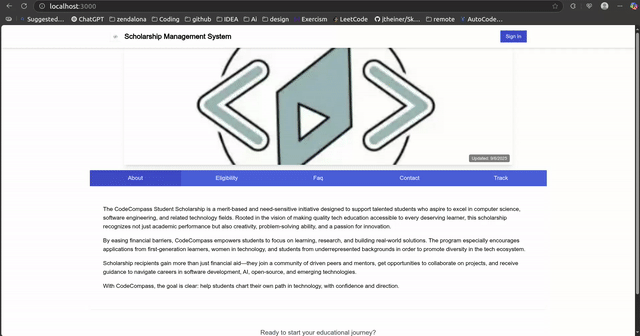

# 🎓 Scholarship Management System

## 📖 Introduction
The **Scholarship Management System** is a web application designed to streamline and automate the management of scholarships for both **administrators** and **students**.  

By digitizing and simplifying scholarship workflows, this system saves **30%–50% of manual effort**, reduces errors, and improves efficiency.  

- **Administrators** can manage scholarship records and applications.  
- **Students** can apply for scholarships and track their status in real time.  

---
---

## 🎥 Demo


 

---


## ⚙️ Technologies Used
This project leverages modern web technologies to ensure scalability, speed, and reliability:

- **[Next.js](https://nextjs.org/):** React framework for SSR and static apps.  
- **[TypeScript](https://www.typescriptlang.org/):** Type safety across the project.  
- **[Tailwind CSS](https://tailwindcss.com/):** Utility-first styling framework.  
- **[Firebase](https://firebase.google.com/):** Authentication + real-time database.  
- **[Vercel](https://vercel.com/):** Hosting with auto-scaled deployments.  
- **[PostgreSQL](https://www.postgresql.org/):** Relational database backend.  
- **[Drizzle ORM](https://orm.drizzle.team/):** Type-safe DB queries.  
- **[Vercel Postgres](https://vercel.com/postgres):** Managed PostgreSQL service.  
- **PostgreSQL on VPS:** For custom self-hosted deployments.  

---

## 🚀 Installation & Setup

### 1️⃣ Clone the Repository
```bash
git clone https://github.com/your-repo-url/scholarship-management-system.git
cd scholarship-management-system
````

### 2️⃣ Install Dependencies

Make sure [Node.js](https://nodejs.org/) is installed, then run:

```bash
npm install
```

### 3️⃣ Configure Environment Variables

Create a `.env.local` file in the project root and add your credentials:

```bash
NEXT_PUBLIC_FIREBASE_API_KEY=your-firebase-api-key
NEXT_PUBLIC_FIREBASE_AUTH_DOMAIN=your-firebase-auth-domain
NEXT_PUBLIC_FIREBASE_PROJECT_ID=your-firebase-project-id

POSTGRES_URL=your-postgres-url
DRIZZLE_DATABASE_URL=your-database-url
```

### 4️⃣ Run the Application Locally

```bash
npm run dev
```

The app will be available at **[http://localhost:3000](http://localhost:3000)**.

### 5️⃣ Deployment

The project is optimized for deployment on **Vercel**.

* By default, it uses **Vercel Postgres** (ensure your connection string is set).
* You can also deploy with your own PostgreSQL on a **VPS**.

---

## ✨ Features

* **Admin Dashboard** → Manage scholarships, review applications, oversee the process.
* **Student Portal** → Apply for scholarships, track status, receive updates.
* **Firebase Authentication** → Secure login & signup.
* **Real-time Notifications** → Instant updates for users.


## 📂 Documentation

A `docs/` folder is available at the root of the project with detailed **developer documentation**.

---

## 🛠️ Contributing

Contributions are welcome! Please fork the repo and create a pull request.

---

## 📜 License

This project is licensed under the **MIT License**.


